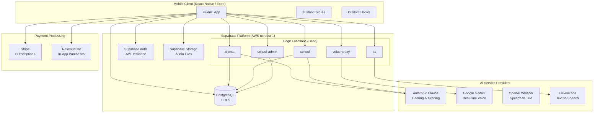
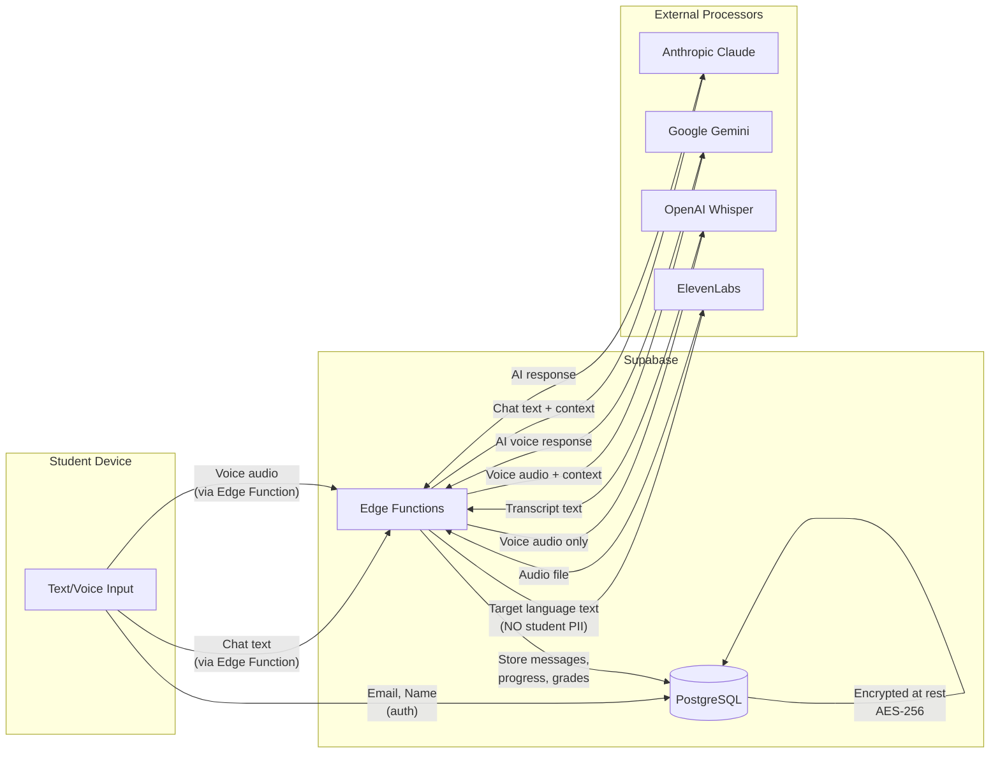
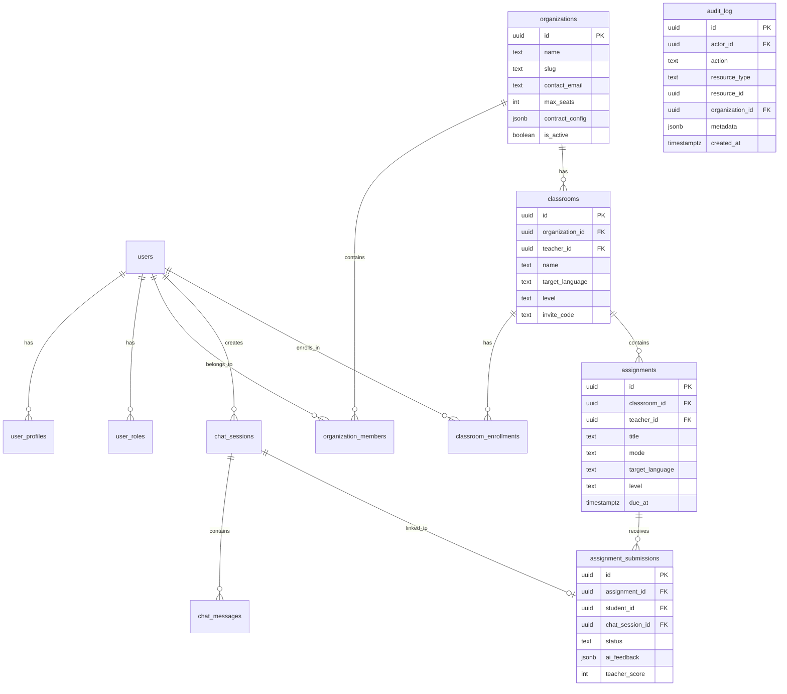
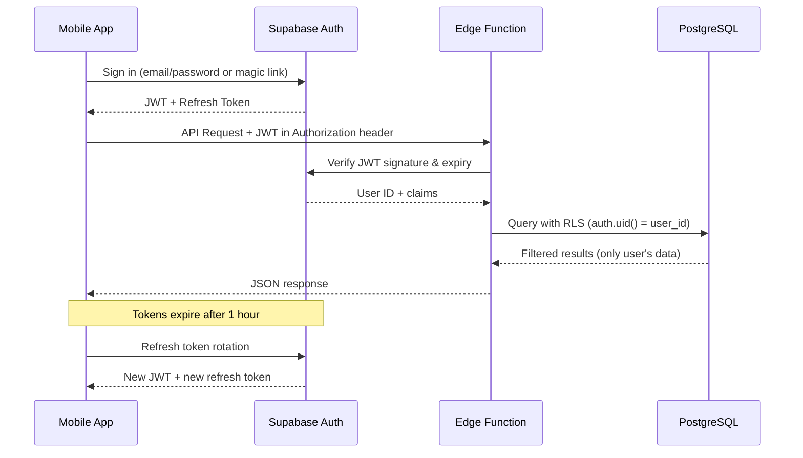
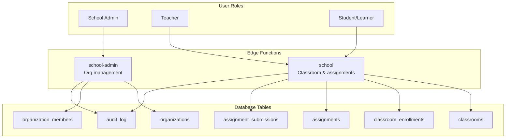

# Architecture Diagrams

**Product:** Fluenci — AI-Powered Language Learning Platform
**Last Updated:** 2026-04-20

---

## 1. System Architecture

---

## 2. Data Flow — PII Paths

**Key PII Flow Notes:**
- Student email and name stored only in Supabase PostgreSQL
- Chat messages pass through Edge Functions to Anthropic (transient, not stored by Anthropic per DPA)
- Voice audio passes through Edge Functions to Google/OpenAI (transient processing)
- ElevenLabs receives only target-language text with no student identifiers
- All transit encrypted with TLS 1.2+

---

## 3. Subprocessor Inventory

| # | Service | Provider | Data Received | Purpose | Retention by Provider | DPA |
|---|---------|----------|---------------|---------|----------------------|-----|
| 1 | Supabase | Supabase Inc (AWS) | All application data | Database, auth, compute, storage | Per contract | Yes |
| 2 | Claude API | Anthropic | Chat messages, assignment text, grading prompts | AI tutoring, automated grading | Not retained (API ToS) | Yes |
| 3 | Gemini API | Google | Voice audio, conversation context | Real-time voice conversation practice | Not retained (API ToS) | Yes |
| 4 | Whisper API | OpenAI | Voice audio recordings | Speech-to-text transcription | Not retained (API ToS) | Yes |
| 5 | ElevenLabs API | ElevenLabs | Target language text (no PII) | Text-to-speech audio generation | Not retained | Yes |
| 6 | Stripe | Stripe Inc | Email, user ID, plan tier | Subscription payment processing | Per Stripe DPA | Yes |
| 7 | RevenueCat | RevenueCat Inc | Anonymous user ID, purchase events | In-app purchase management | Per RevenueCat DPA | Yes |

---

## 4. Database Schema Overview

---

## 5. Authentication Flow

---

## 6. School Feature Architecture

