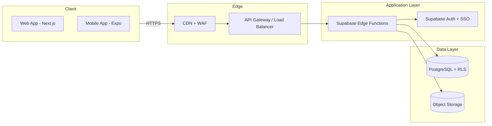

# Technical Guide for Selling to Schools & Universities

> This document extends the high-level report (`selling-software-to-schools.md`) with concrete technical patterns, architecture examples, and implementation details that higher-education IT teams typically expect to see.
>
> It lives inside the codebase so future edits and AI tools can reference concrete examples and standards rather than vague instructions.

---

## Backend Models Universities Expect

### Typical SaaS Backend Stack

Universities are generally comfortable with modern cloud-native stacks as long as they are clearly segmented, secure, and observable. A reference backend stack that usually lands well:

**Hosting / runtime**
- Containers on a managed platform such as AWS ECS/Fargate, EKS, GCP Cloud Run, or Azure App Service.
- Separate environments: production, staging, and development, ideally in different accounts/projects or clearly isolated resource groups.

**API layer**
- REST or GraphQL over HTTPS only, with TLS 1.2+ enforced and HTTP redirected to HTTPS.
- API gateway or reverse proxy handling routing, rate limiting, and central request logging.

**Databases**
- Managed relational DB (PostgreSQL or MySQL) with:
  - Encryption at rest using provider-managed keys (KMS or equivalent).
  - Automated backups and point-in-time recovery with tested restore procedures.
  - Private network access only (VPC, no public DB endpoint).

**File / object storage**
- Object storage for uploads (S3, GCS, Azure Blob) with server-side encryption and least-privilege bucket policies.

**Secrets & configuration**
- Secrets stored in a managed secret store (AWS Secrets Manager, SSM Parameter Store, GCP Secret Manager, etc.), never in code or Git.

This aligns with widely published SaaS reference architectures and feels "normal" to higher-ed security reviewers.

---

## Multi-tenant Data Models That Look Professional

Even if you are starting with one school, having a multi-tenant story signals long-term maturity.

### Common Tenant-isolation Patterns

| Pattern | Description | Pros | Cons |
|---------|-------------|------|------|
| **Pooled DB + tenant_id** | Single database where each row is scoped by `tenant_id`/`institution_id`, enforced via row-level security (RLS) or strict application checks. | Operationally simple, cost-efficient, easy to scale for many tenants. | Requires rigorous RLS and query discipline; harder to isolate/migrate one tenant later. |
| **Schema-per-tenant** | One DB cluster with separate schemas per institution (e.g., `bryant_u`, `school_x`). | Clear logical separation; easier exports and deletions by tenant. | Schema changes must be applied N times; more ops complexity. |
| **Database-per-tenant** | Separate DB instance per institution. | Strong isolation; easy compliance story for big/sensitive tenants. | Higher infra cost and management overhead; overkill for many small schools. |

**For Fluenci's current stage:** Pooled DB + RLS is the best starting point. Be prepared to show exactly how `institution_id` is enforced in queries (Supabase RLS policies handle this).

---

## Example Architecture Diagrams

### High-level System Architecture

**Components:**

- **Client applications**
  - Web SPA (Next.js) served over HTTPS.
  - Mobile apps (React Native/Expo) communicating with the same API.

- **Edge**
  - CDN + WAF (e.g., Cloudflare, AWS CloudFront + WAF) in front of all public endpoints.
  - API gateway / load balancer routing requests to app services.

- **Application layer**
  - Stateless backend services (Supabase Edge Functions) implementing business logic.
  - Identity and auth: Supabase Auth plus SAML/OIDC SSO integration for institutions.

- **Data layer**
  - Primary PostgreSQL database (Supabase) with tenant isolation through `institution_id` + RLS.
  - Object storage for files and reports (Supabase Storage).

- **Observability and operations**
  - Centralized logs, metrics, and alerts.
  - CI/CD pipeline enforcing tests, linting, and basic security checks.

### Mermaid Diagram



> Drop this diagram into presentations and be able to walk through it — this is exactly what IT wants to see.

---

## Security & HECVAT-style Controls (Concrete Examples)

Many universities use the Higher Education Community Vendor Assessment Toolkit (HECVAT) as a standard vendor security questionnaire. Pre-answer common themes in a short "Security Overview" doc.

### Example Strong Answers

Adapt the language below to your actual stack:

**Encryption in transit**
> "All web and API traffic uses HTTPS with TLS 1.2+; HTTP is redirected to HTTPS and HSTS is enabled at the edge."

**Encryption at rest**
> "All databases, backups, and object storage that hold institutional data are encrypted at rest using AES-256 with provider-managed keys (KMS-style). No institutional data is stored on unencrypted media."

**Access control & least privilege**
> "Production access is limited to a small set of named engineers using SSO + MFA, VPN/IP restrictions, and least-privilege IAM roles. No shared or generic admin accounts are used."

**Vulnerability management**
> "We run automated dependency and container image scanning in CI and periodic infrastructure scans; high/critical vulnerabilities are remediated according to internal SLAs."

**Backups & disaster recovery**
> "We perform automated daily backups of the production database and allow point-in-time recovery for at least 30 days. Restore procedures are tested at least annually."

**Incident response**
> "We maintain an incident-response plan covering detection, triage, containment, remediation, and communication. For incidents affecting institutional data, we notify the institution within 72 hours of confirmation, consistent with contract terms."

These map directly to typical HECVAT domains: encryption, access control, vulnerability management, business continuity, and incident response.

---

## FERPA & Privacy: Specific Technical Design Choices

FERPA expects institutions to maintain control over education records and requires that service providers use those records only for authorized educational purposes.

### Data Minimization & Purpose

- Store only fields necessary for the use case (`institution_id`, student ID or email, name, role).
- Avoid collecting unnecessary sensitive attributes (DOB, SSN, full address).
- Explicitly commit not to sell, share, or repurpose education records for unrelated analytics or advertising.

### Retention & Deletion

Implement internal/admin functions to:
- Deactivate user accounts.
- Delete or anonymize PII while preserving aggregate/trend data where appropriate.
- Document default retention windows for logs, backups, and application data.
- Describe how retention can be adjusted at the institution's request.

### Audit Logging

Log access to sensitive student records (profiles, grades, progress data) with:
- **Actor** (user ID, institution ID)
- **Timestamp** and source IP
- **Action** (read/update/delete)

Summarize these in a one-page "Data Handling & FERPA Alignment" document for IT and legal review.

---

## Identity, SSO, and Attribute Mapping

Universities strongly prefer integrating with their existing identity systems via SAML or OIDC (often Shibboleth or Okta).

### Common SAML Attribute Set

Based on eduPerson and higher-ed identity documentation:

| Attribute | Purpose |
|-----------|---------|
| `eduPersonPrincipalName` | Primary unique identifier (e.g., `netid@school.edu`) |
| `mail` | Email address |
| `givenName` | First name |
| `sn` | Last name |
| `eduPersonAffiliation` | Roles such as `student`, `faculty`, `staff` |

**Integration guide language:**
> "Our SAML Service Provider expects `eduPersonPrincipalName` (or `mail`) as the unique identifier, plus `givenName`, `sn`, and optionally `eduPersonAffiliation` for role mapping."

This shows IT that you understand their IdP practices and attribute vocabulary.

### Example SAML SSO Flow

1. User clicks "Login with University SSO" in the application.
2. App sends a SAML `AuthnRequest` to the university's IdP.
3. The IdP authenticates the user (NetID + MFA as configured by the school).
4. The IdP returns a signed SAML assertion with attributes to the SP endpoint.
5. Backend validates the assertion, extracts the identifier and attributes, links/creates the user with `institution_id`, and issues a session or JWT.

---

## Accessibility Deliverables

Accessibility requirements are now common in RFPs and vendor assessments, especially in higher education.

### Minimum Accessibility Packet

**Accessibility statement**
- Public or sharable statement describing the goal (e.g., WCAG 2.1 AA), known gaps, and how users can report issues.

**VPAT or equivalent**
- A VPAT or similar table listing WCAG criteria with statuses like "Supports", "Partially supports", or "Does not support".

**Implementation practices**
- Semantic HTML, proper form labels, keyboard navigability, adequate color contrast, screen-reader support, and sensible ARIA usage.

**Testing process**
- Automated accessibility checks (e.g., axe, Lighthouse) integrated into development, plus occasional manual tests with screen readers.

> Keep this in an `accessibility_and_vpat.md` file so it's easy to update as the UI evolves.

---

## Implementation Patterns for Campus Pilots

Most successful EdTech deployments in higher education start with a constrained pilot and then scale.

### Example Departmental Pilot Plan

**Phase 1: Technical setup (2-4 weeks)**
- Provision a tenant/config for the institution (branding, URL, SSO settings).
- Configure and test SAML/OIDC SSO with a small pilot user group.
- Onboard users via CSV import or SIS export; set roles and permissions.

**Phase 2: Limited pilot (one term)**
- Run with one or a few courses, labs, or administrative units.
- Provide concise training materials (short video walkthroughs, quickstart guides).
- Track metrics: login frequency, feature usage, impact on workflows (time saved, engagement).

**Phase 3: Evaluate and decide on scale**
- Survey and interview pilot users.
- Produce a short "Pilot Outcome" memo with usage stats, reliability, issues, and proposed improvements.
- Use this evidence to argue for expanding to additional departments or for a campus-wide license.

Many LMS plug-ins, dashboards, and language-learning tools have scaled through this exact **pilot -> evidence -> expansion** pattern in educational contexts.

---

## Suggested Documentation Structure

To make this guidance actionable, maintain the following files alongside your code:

```
docs/
├── selling_to_schools_overview.md          # High-level report (original)
├── technical_guide_for_schools.md          # This file — advanced technical guide
├── architecture_diagrams.md                # Mermaid or image-based architecture diagrams
├── security_overview_for_it.md             # HECVAT-style answers and security summary
├── privacy_and_ferpa_alignment.md          # Detailed data handling and FERPA notes
├── accessibility_and_vpat.md               # Accessibility statement and VPAT content
└── pilot_implementation_plan.md            # Phased campus pilot plan with metrics
```

Keeping these documents versioned alongside your code ensures that future edits — by you or by AI tools — stay grounded in clear, school-focused technical and process expectations rather than ad-hoc decisions.

---

## How This Applies to Fluenci

| Requirement | Current State | Action Needed |
|-------------|---------------|---------------|
| Multi-tenant isolation | Supabase RLS with `institution_id` on school tables | Document RLS policies; ensure all school queries enforce `institution_id` |
| SSO / SAML | Not yet implemented | Add SAML SP support (Supabase supports SAML via enterprise plan, or add custom SP) |
| Encryption at rest | Supabase default (AES-256) | Document in security overview |
| Encryption in transit | HTTPS enforced | Document in security overview |
| Audit logging | Partial (Supabase logs) | Add application-level audit trail for student record access |
| Data deletion | Admin functions needed | Build institution data export + purge endpoints |
| Accessibility | Basic (needs audit) | Run axe/Lighthouse, fix issues, produce VPAT |
| HECVAT | Not started | Complete HECVAT Lite using answers above |
| Pilot plan | Teacher portal exists | Package as a "one-class pilot" offering with clear metrics |
